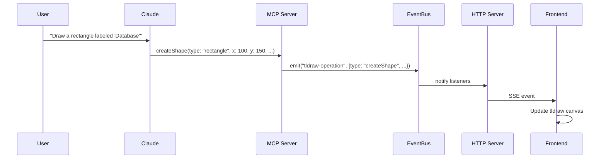
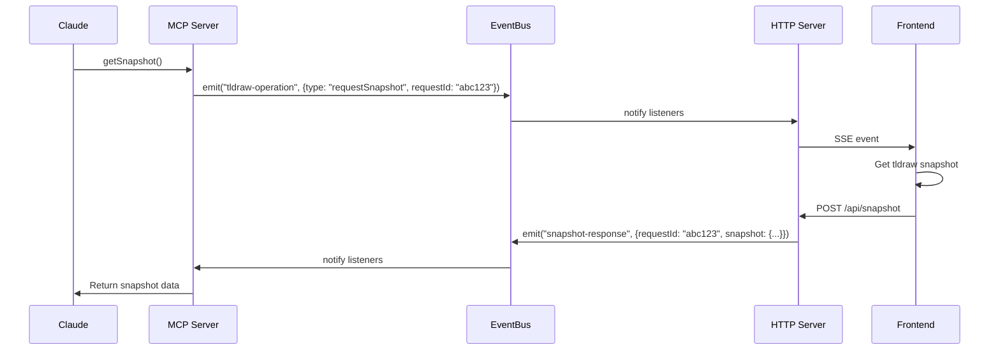

# Tldraw MCP Server

This project integrates [tldraw](https://tldraw.com/) with Claude AI using the Model Context Protocol (MCP). It allows Claude to create and manipulate diagrams based on natural language instructions.

## Architecture Overview

The application consists of:

1. **MCP Server**: Handles function calls from Claude AI
2. **HTTP Server**: Provides Server-Sent Events (SSE) endpoints
3. **Next.js Frontend**: Renders the tldraw canvas and listens for operations
4. **EventBus**: Facilitates type-safe communication between components

## Key Interactions

### 1. Creating a Shape

When a user asks Claude to create a diagram element, the following sequence occurs:



#### Step-by-Step Process:

1. **User Request**: User asks Claude to create a diagram element
2. **Claude Analysis**: Claude processes the request and calls the appropriate MCP function
3. **MCP Function Call**: The `createShape` function is executed with parameters
4. **Event Broadcasting**: The operation is broadcast through the EventBus
5. **HTTP Transmission**: The HTTP server forwards the event as an SSE message
6. **Frontend Rendering**: The frontend receives the event and updates the tldraw canvas

### 2. Getting a Snapshot

When Claude needs the current state of the diagram:



#### Step-by-Step Process:

1. **Snapshot Request**: Claude calls the `getSnapshot` function
2. **Request ID Generation**: The MCP server generates a unique request ID
3. **Snapshot Request Broadcasting**: The request is broadcast through EventBus
4. **Frontend Processing**: The frontend receives the request and captures the current canvas state
5. **Snapshot Submission**: The frontend sends the snapshot back to the server
6. **Response Processing**: The EventBus routes the snapshot back to the waiting MCP function
7. **Return to Claude**: The snapshot data is returned to Claude

## Why We Use EventBus

The EventBus provides several important benefits, even in a single-client scenario:

### 1. Decoupled Architecture

EventBus creates a clean separation between different components:

- MCP server can focus on handling Claude's function calls
- HTTP server can focus on client communication
- Components can communicate without direct references to each other

### 2. Asynchronous Communication

The EventBus enables asynchronous communication patterns:

- MCP functions can trigger operations without waiting for UI updates
- Snapshot requests can be handled asynchronously with promises

### 3. Centralized Event Management

All communication flows through a single channel:

- Consistent event handling patterns
- Easier debugging (all events can be logged in one place)
- Simplified error handling

### 4. Extensibility

The EventBus pattern makes the system more extensible:

- New event types can be added without changing the communication architecture
- Additional listeners can be added without modifying existing code
- Future support for multiple clients would be easier to implement

## Getting Started

1. Install dependencies for both the frontend and server:

   ```powershell
   # Install Next.js frontend dependencies
   npm install

   # Install MCP server dependencies
   cd server
   npm install
   cd ..
   ```

2. Build and start the MCP server:

   ```powershell
   cd server
   npm run build
   npm start
   # Or simply use the start.bat script
   ```

3. In another terminal, start the HTTP server:

   ```powershell
   cd server
   npm run start:http
   # Or simply use the start-http.bat script
   ```

4. In a third terminal, start the Next.js frontend:

   ```powershell
   npm run dev
   ```

5. Connect Claude Desktop to your MCP server by updating your Claude Desktop configuration file (typically located at `%AppData%\Claude\claude_desktop_config.json`):

   ```json
   {
     "mcpServers": {
       "tldrawserver": {
         "command": "node",
         "args": ["PATH_TO_COMPILED_JS_FILE"]
       }
     }
   }
   ```

   Replace `PATH_TO_COMPILED_JS_FILE` with the absolute path to the compiled JavaScript file, e.g., `D:\\tldraw-mcp\\server\\dist\\index.js`.

6. Open [http://localhost:3000](http://localhost:3000) in your browser to see the tldraw interface

## Project Structure

- **server/**: MCP server implementation
  - **src/**: TypeScript source files
    - **index.ts**: Main MCP server with function definitions
    - **httpServer.ts**: HTTP server for SSE communication
    - **eventBus.ts**: Event bus implementation with TypeScript interfaces
  - **dist/**: Compiled JavaScript files (generated)
  - **build.bat**: Script to compile TypeScript
  - **start.bat**: Script to build and run the MCP server
  - **start-http.bat**: Script to build and run the HTTP server
- **app/**: Next.js frontend
  - **components/TldrawEditor.tsx**: Frontend component with tldraw integration
  - **api/events/route.ts**: Next.js API route for SSE events
  - **api/snapshot/route.ts**: Next.js API route for snapshots

## Available MCP Tools

The following tools are available to Claude via the MCP server:

- `createShape`: Create basic shapes (rectangle, ellipse, triangle, diamond)
- `connectShapes`: Connect shapes with arrows
- `addText`: Add standalone text elements
- `createFlowchartStep`: Create a flowchart step (with optional connection to previous step)
- `getSnapshot`: Get a snapshot of the current diagram

## Technology Stack

- **Backend**: Node.js, TypeScript, Model Context Protocol SDK
- **Frontend**: Next.js, React
- **Diagramming**: tldraw
- **Communication**: Server-Sent Events (SSE), EventBus

## Type Safety

The project implements TypeScript interfaces for all message types to ensure type safety across the application, including:

- Specific payload types for each event
- Type guards for runtime type checking
- Strong typing for all MCP function parameters

## Deploy on Vercel

The easiest way to deploy your Next.js app is to use the [Vercel Platform](https://vercel.com/new?utm_medium=default-template&filter=next.js&utm_source=create-next-app&utm_campaign=create-next-app-readme) from the creators of Next.js.

Check out our [Next.js deployment documentation](https://nextjs.org/docs/app/building-your-application/deploying) for more details.
