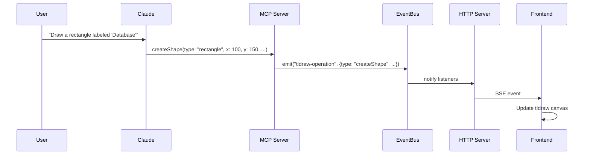
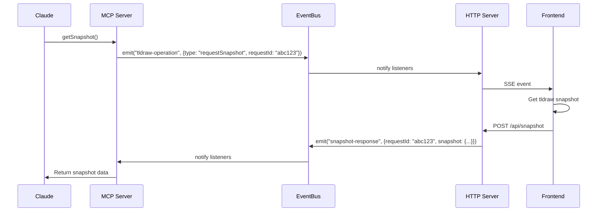

# Tldraw MCP Server

This project integrates [tldraw](https://tldraw.com/) with Claude AI using the Model Context Protocol (MCP). It allows Claude to create and manipulate diagrams based on natural language instructions.

## Getting Started

### Prerequisites

- Node.js 18+ installed
- Claude Desktop installed
- Visual Studio Code (recommended)

### Installation and Setup

1. **Clone and install dependencies:**

   ```powershell
   cd tldraw-mcp
   npm install
   cd server
   npm install
   ```

2. **Build the server code:**

   ```powershell
   cd server
   npm run build
   ```

3. **Configure Claude Desktop:**

   Create or edit the Claude Desktop configuration file at `%AppData%\Claude\claude_desktop_config.json`:

   ```json
   {
     "mcpServers": {
       "tldrawserver": {
         "command": "node",
         "args": ["D:\\tldraw-mcp\\server\\dist\\index.js"]
       }
     }
   }
   ```

   Replace the path with the absolute path to the compiled server file.

### Starting the Application

You need to start three components in the following order:

1. **Start the HTTP Server:**

   ```powershell
   # In the server directory
   npm run start:http
   ```

2. **Start the Next.js Frontend:**

   ```powershell
   # In the root directory
   npm run dev
   ```

3. **Start Claude Desktop and enable the MCP Server:**

   - Launch Claude Desktop
   - Open settings (gear icon)
   - Go to the "Advanced" tab
   - Under "MCP Servers", enable "tldrawserver"
   - Click "Apply"

### Verifying the Setup

1. Open your browser to `http://localhost:3000`
2. You should see the tldraw canvas
3. In Claude Desktop, try a command like:
   ```
   Create a flowchart with two steps: "Start" and "Process Data"
   ```

### Testing the System

To fully test the integration, try the following Claude commands:

1. **Create a simple diagram:**

   ```
   Create a rectangle labeled "Database" at position (200, 300) with width 150 and height 100
   ```

2. **Create and connect shapes:**

   ```
   Create an ellipse labeled "User" at position (100, 100) with width 120 and height 80,
   and a rectangle labeled "API" at position (300, 100) with width 150 and height 80.
   Then connect the "User" shape to the "API" shape.
   ```

3. **Create a flowchart:**

   ```
   Create a flowchart with the following steps:
   1. "Start Process"
   2. "Collect Data"
   3. "Analyze Results"
   4. "Generate Report"
   ```

4. **Add standalone text:**

   ```
   Add text "CONFIDENTIAL" at position (400, 50) with font size 24
   ```

5. **Get a snapshot of the current diagram:**
   ```
   Take a snapshot of the current diagram
   ```

### Verifying Event Flow

To verify that events are flowing correctly through the system:

1. Open your browser's developer tools (F12 or Ctrl+Shift+I)
2. Go to the Console tab
3. Look for log messages with prefixes:
   - `[EventBus]` - Events being broadcast internally
   - `[HTTP Server]` - Messages from the HTTP server
   - `[API]` - Messages from the Next.js API routes
   - Log messages from TldrawEditor component

When you issue a command in Claude, you should see a sequence of logs showing the operation moving through each part of the system.

### Troubleshooting

- **HTTP Server not starting:** Check if port 3002 is already in use
- **Claude not connecting:** Verify the path in `claude_desktop_config.json`
- **Diagram not updating:** Check browser console for errors in the event stream
- **Types of operations not working:** Check log messages for errors in parsing or handling specific operations
- **Snapshot functionality issues:** Check if `snapshot-response` events are being correctly processed

#### Common Issues and Solutions

- **Port conflicts:** If port 3002 is in use, edit `httpServer.ts` to use a different port, and update the API routes accordingly
- **Timing issues:** If operations seem to drop, increase logging and check for race conditions
- **Type errors:** If you encounter "any" type errors, define proper interfaces in `eventBus.ts`
- **Missing dependencies:** Run `npm install` in both the root and server directories

## Architecture Overview

The application consists of:

1. **MCP Server**: Handles function calls from Claude AI
2. **HTTP Server**: Provides Server-Sent Events (SSE) endpoints
3. **Next.js Frontend**: Renders the tldraw canvas and listens for operations
4. **EventBus**: Facilitates type-safe communication between components

## Key Interactions

### 1. Creating a Shape

When a user asks Claude to create a diagram element, the following sequence occurs:



#### Step-by-Step Process:

1. **User Request**: User asks Claude to create a diagram element
2. **Claude Analysis**: Claude processes the request and calls the appropriate MCP function
3. **MCP Function Call**: The `createShape` function is executed with parameters
4. **Event Broadcasting**: The operation is broadcast through the EventBus
5. **HTTP Transmission**: The HTTP server forwards the event as an SSE message
6. **Frontend Rendering**: The frontend receives the event and updates the tldraw canvas

### 2. Getting a Snapshot

When Claude needs the current state of the diagram:



#### Step-by-Step Process:

1. **Snapshot Request**: Claude calls the `getSnapshot` function
2. **Request ID Generation**: The MCP server generates a unique request ID
3. **Snapshot Request Broadcasting**: The request is broadcast through EventBus
4. **Frontend Processing**: The frontend receives the request and captures the current canvas state
5. **Snapshot Submission**: The frontend sends the snapshot back to the server
6. **Response Processing**: The EventBus routes the snapshot back to the waiting MCP function
7. **Return to Claude**: The snapshot data is returned to Claude

## Why We Use EventBus

The EventBus provides several important benefits, even in a single-client scenario:

### 1. Decoupled Architecture

EventBus creates a clean separation between different components:

- MCP server can focus on handling Claude's function calls
- HTTP server can focus on client communication
- Components can communicate without direct references to each other

### 2. Asynchronous Communication

The EventBus enables asynchronous communication patterns:

- MCP functions can trigger operations without waiting for UI updates
- Snapshot requests can be handled asynchronously with promises

### 3. Centralized Event Management

All communication flows through a single channel:

- Consistent event handling patterns
- Easier debugging (all events can be logged in one place)
- Simplified error handling

### 4. Extensibility

The EventBus pattern makes the system more extensible:

- New event types can be added without changing the communication architecture
- Additional listeners can be added without modifying existing code
- Future support for multiple clients would be easier to implement

## Getting Started

1. Install dependencies for both the frontend and server:

   ```powershell
   # Install Next.js frontend dependencies
   npm install

   # Install MCP server dependencies
   cd server
   npm install
   cd ..
   ```

2. The easiest way to start everything is to use the provided script:

   ```powershell
   # This will start all components in separate windows
   ./start-all.bat
   ```

   Or if you prefer to start each component manually:

   ```powershell
   # Start the MCP server (for Claude)
   cd server
   npm run build
   npm start  # Or use ./start.bat

   # In another terminal, start the HTTP server
   cd server
   npm run start:http  # Or use ./start-http.bat

   # In a third terminal, start the Next.js frontend
   npm run dev
   ```

3. Configure Claude Desktop to connect to your MCP server:

   ```powershell
   # Run the setup script to automatically configure Claude Desktop
   ./setup-claude.bat
   ```

   Or manually update your Claude Desktop configuration file (typically located at `%AppData%\Claude\claude_desktop_config.json`):

   ```json
   {
     "mcpServers": {
       "tldrawserver": {
         "command": "node",
         "args": ["PATH_TO_COMPILED_JS_FILE"]
       }
     }
   }
   ```

   Replace `PATH_TO_COMPILED_JS_FILE` with the absolute path to the compiled JavaScript file, e.g., `D:\\tldraw-mcp\\server\\dist\\index.js`.

4. Open [http://localhost:3000](http://localhost:3000) in your browser to see the tldraw interface

5. Restart Claude Desktop and tell it: "I'd like to use the tldrawserver MCP server to draw a diagram"

## Project Structure

- **server/**: MCP server implementation
  - **src/**: TypeScript source files
    - **index.ts**: Main MCP server with function definitions
    - **httpServer.ts**: HTTP server for SSE communication
    - **eventBus.ts**: Event bus implementation with TypeScript interfaces
  - **dist/**: Compiled JavaScript files (generated)
  - **build.bat**: Script to compile TypeScript
  - **start.bat**: Script to build and run the MCP server
  - **start-http.bat**: Script to build and run the HTTP server
- **app/**: Next.js frontend
  - **components/TldrawEditor.tsx**: Frontend component with tldraw integration
  - **api/events/route.ts**: Next.js API route for SSE events
  - **api/snapshot/route.ts**: Next.js API route for snapshots

## Tldraw Shape Types

Important note about tldraw's shape types:

Tldraw uses a specific shape type system that differs from our simple descriptive names. The mapping is as follows:

- For basic shapes (rectangle, ellipse, triangle, diamond), tldraw uses a "geo" type with a "geo" property specifying the actual shape
- For text, tldraw uses a "text" type
- For arrows/connectors, tldraw uses an "arrow" type

For example, when we specify a "rectangle" in our API, TldrawEditor.tsx maps this to:

```tsx
editor.createShape({
  type: "geo",
  props: {
    geo: "rectangle",
    // other properties
  },
});
```

This mapping is handled automatically in the TldrawEditor component.

## Available MCP Tools

The following tools are available to Claude via the MCP server:

- `createShape`: Create basic shapes (rectangle, ellipse, triangle, diamond)
- `connectShapes`: Connect shapes with arrows
- `addText`: Add standalone text elements
- `createFlowchartStep`: Create a flowchart step (with optional connection to previous step)
- `getSnapshot`: Get a snapshot of the current diagram

## Technology Stack

- **Backend**: Node.js, TypeScript, Model Context Protocol SDK
- **Frontend**: Next.js, React
- **Diagramming**: tldraw
- **Communication**: Server-Sent Events (SSE), EventBus

## Type Safety

The project implements TypeScript interfaces for all message types to ensure type safety across the application, including:

- Specific payload types for each event
- Type guards for runtime type checking
- Strong typing for all MCP function parameters

## Deploy on Vercel

The easiest way to deploy your Next.js app is to use the [Vercel Platform](https://vercel.com/new?utm_medium=default-template&filter=next.js&utm_source=create-next-app&utm_campaign=create-next-app-readme) from the creators of Next.js.

Check out our [Next.js deployment documentation](https://nextjs.org/docs/app/building-your-application/deploying) for more details.
