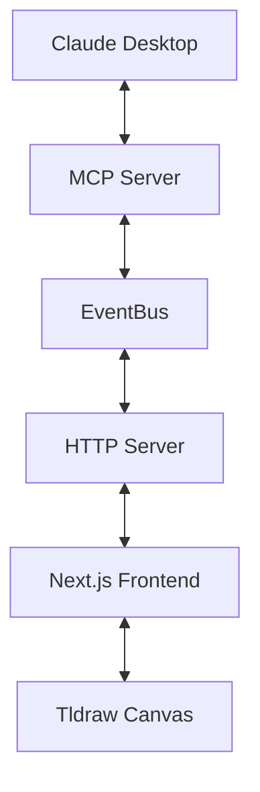

# Tldraw MCP Server

This is the MCP server component for the tldraw-Claude integration. It handles communication with Claude Desktop through the Model Context Protocol (MCP) and provides an HTTP server for Server-Sent Events (SSE) to communicate with the frontend.

## System Architecture

This server consists of two main components:

1. **MCP Server (index.ts)**: Handles function calls from Claude via stdin/stdout
2. **HTTP Server (httpServer.ts)**: Provides SSE endpoints for frontend communication

These components communicate through an EventBus that manages event propagation.

## Getting Started

### Prerequisites

- Node.js 18+ installed
- TypeScript installed globally (`npm install -g typescript`)

### Installation

1. Install dependencies:

   ```powershell
   npm install
   ```

2. Build the TypeScript code:

   ```powershell
   npm run build
   ```

### Running the Servers

You need to run both servers for the system to work properly:

1. **Start the HTTP Server (in one terminal):**

   ```powershell
   npm run start:http
   ```

   This starts the HTTP server on port 3002, which handles SSE communication with the frontend.

2. **Start the MCP Server (in another terminal):**

   ```powershell
   npm start
   ```

   This starts the MCP server that communicates with Claude Desktop.

### Development Mode

For development with automatic restarts:

```powershell
# For the MCP server (in one terminal)
npm run dev

# For the HTTP server (in another terminal)
npm run dev:http
```

## Claude Desktop Configuration

To connect Claude Desktop to this MCP server, add the following to your Claude Desktop configuration file (typically located at `%AppData%\Claude\claude_desktop_config.json`):

```json
{
  "mcpServers": {
    "tldrawserver": {
      "command": "node",
      "args": ["PATH_TO_COMPILED_JS_FILE"]
    }
  }
}
```

Replace `PATH_TO_COMPILED_JS_FILE` with the absolute path to the compiled JavaScript file, e.g., `D:\\tldraw-mcp\\server\\dist\\index.js`.

## Development

For development with automatic restarts:

```powershell
# For the MCP server
npm run dev

# For the HTTP server
npm run dev:http
```

## Build Scripts

- **build.bat**: Compiles TypeScript code into JavaScript in the `dist` folder
- **start.bat**: Builds the code and then starts the MCP server
- **start-http.bat**: Builds the code and then starts the HTTP server

## Architecture

- **MCP Server (index.ts)**: Handles function calls from Claude via stdin/stdout
- **HTTP Server (httpServer.ts)**: Provides SSE endpoints for frontend communication
- **EventBus**: Manages internal event propagation and provides type-safe communication

## Architecture

### Component Overview

1. **MCP Server (index.ts)**

   - Handles function calls from Claude via stdin/stdout
   - Defines available tools that Claude can use
   - Sends and receives operations through the EventBus

2. **HTTP Server (httpServer.ts)**

   - Provides SSE endpoints for frontend communication
   - Listens on port 3002
   - Forwards operations from EventBus to connected clients
   - Receives snapshot data from frontend

3. **EventBus (eventBus.ts)**
   - Manages internal event propagation
   - Provides type-safe communication between components
   - Handles event subscription and broadcasting

### Communication Flow



### Sequence Diagram for Operations

```
Claude → MCP Server → EventBus → HTTP Server → Next.js → Tldraw Canvas
```

### Sequence Diagram for Snapshots

```
Claude → MCP Server → EventBus → HTTP Server → Next.js → Tldraw Canvas
Tldraw Canvas → Next.js → HTTP Server → EventBus → MCP Server → Claude
```

## Type Safety

The server implements TypeScript interfaces for all message types to ensure type safety across the application:

```typescript
// Example payload types in eventBus.ts
export interface TldrawShapePayload {
  shapeType: string;
  x: number;
  y: number;
  width: number;
  height: number;
  text?: string;
}

export interface TldrawConnectPayload {
  fromId: string;
  toId: string;
  arrowType?: "straight" | "curved" | "orthogonal";
}
```

## Debugging

### Logging

The system includes extensive logging to help diagnose issues:

- **EventBus logs:** Show operations being broadcast
- **HTTP Server logs:** Show incoming/outgoing connections and events
- **MCP Server logs:** Show function calls from Claude

### Common Issues

1. **Type errors:** If you encounter "any" type errors, check the interface definitions in `eventBus.ts`
2. **Event handling:** Make sure event names match between components (`tldraw-operation`, `snapshot-response`, etc.)
3. **Port conflicts:** If port 3002 is already in use, modify the port in `httpServer.ts` and update the API routes

## Development Tips

1. Use the development scripts for automatic reloading during development
2. Keep the browser console open to monitor event flow
3. Test each operation type individually before complex scenarios
4. Check Claude Desktop logs if MCP communication isn't working
